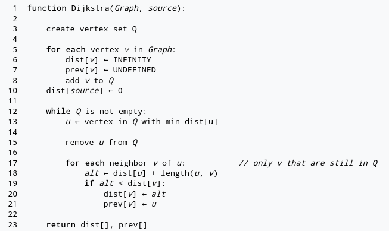

# Performance study of Dijkstra's Algorithm

This repository contains a performance study over different implementation
details of Dijkstra's algorithm. It uses a criterion benchmark to quantify the
difference between the implementations.

# Usage

The code uses OpenStreetMap data to create the underlying graph for the
benchmarks. You need to supply an osm.pbf file for example from
[here](https://download.geofabrik.de/). As the benchmark runs many queries and
the especially the first implementation is pretty inefficient I would suggest
using small graphs such as [Isle of
Man](https://download.geofabrik.de/europe/isle-of-man-latest.osm.pbf) or the
german county
[Saarland](https://download.geofabrik.de/europe/germany/saarland-latest.osm.pbf).

If you have the code and a pbf file you can do the following to compile the code
and prepare the graph for benchmarking.

```sh
cargo build --release
./target/release/prepare_graph path/to/pbf [number of nodes] [seed]
```

This will extract a graph from the file, randomly choose (according to the seed
you can optionally pass) a certain number of sources and targets for the
benchmark (default 3) and save this in a binary file which is then used by the benchmark.

To run the benchmark for the current implementation use:

```sh
cargo bench
```

This will give you the results of the current implementation and the difference
to the last run of `cargo bench`.

You can check that the implementations are equivalent via the distances utility
of this repo. After compiling you can save the distances (in m) of the source
target combinations via:

```sh
./target/release/distances > distances.txt
```

If you switch to another implementation you can use the following to compare the results :

```sh
./target/release/distances | diff distances.txt -
```

If there is no output then everything is correct.

# Implementations

All implementations that are suitable for benchmarking are tagged and contained
in [dijkstra.rs](src/dijkstra.rs). Please note that the benchmarks
only compare Dijkstra's algorithm implementation but the underlying graph data
structure is not considered, which plays an important part in the overall
performance. This benchmark uses an Adjacency Array Graph as described in
Algorithms and data structures: The basic toolbox by Kurt Mehlhorn and Peter
Sanders. This data structure is memory and cache efficient and can only be used
for static graphs. The performance improvements I state below are of course
specific to my hardware as well as the graph and source and target nodes I
generated. They always compare to subsequent iterations of the implementation
and are only stated for a rough overview. Feel free to open an
issue/pull-request if you encounter strong deviation.

## Wikipedia's Implementation

If you look at the [wikipedia
entry](https://en.wikipedia.org/wiki/Dijkstra%27s_algorithm) on Dijkstra's
algorithm the first implementation you find (as of writing this readme) is this:



This implementation uses a set of all undiscovered nodes and a linear sweep over
this set in each round of the algorithm. This results in an O(n^2) runtime and
is therefore really slow. It can be found under the tag _wiki-version_. Please
note, that the article does also list better versions of the algorithm. I do
find it unfortunate to start with a very inefficient one.

## Using a frontier set instead of an undiscovered set

Under the tag _necessary-nodes-only_ the code from above is improved to keep only
nodes in the set which are on the frontier of the search. Such a node has at
least one edge which leads to it processed, but the shortest path distance for
it has not yet been settled. This small change leads to about 90% runtime
reduction to the previous version.

## Using a binary heap instead of a set

If you replace the frontier set with a frontier binary heap, you get an
implementation with an O(n log n) runtime complexity. That again improved
runtime by about 70%. The implementation does not use the decrease key operation
of a heap, because it is not present in the heap implementation of the standard
library. The tag is _heap_.

## Stopping when the target node is reached

All the previous implementations had been one to all queries. If we stop after
the destination node is pulled out of the heap, we do improve the algorithm
asymptotically but have large improvements on "short" queries (as in the
distance is smalled compared to the graph diameter). The runtime was reduced
between 5% and 90% in my benchmarks for the implementation under tag
_one-to-one_.

## Reuse data structures instead of reallocating them

In each of the previous versions the distance and previous node vectors as well
as the heap/set were allocated for each query. As the vectors need to be #nodes
long this can be a substantial amount of allocation time per query. Instead
under the tag _avoid-reallocation_, these data structures are part of the
Dijkstra structure and are reset before each queries to their original state.
This again benefits "short" queries more than "longer" ones. The improvements
range from negligible to 15%.

## Upgrading to on demand one-to-many implementation

This last improvement is tagged _warm-start_. It is based on the observation,
that queries from the same start node can reuse the progress already made by the
algorithm. This makes subsequent runs with the same start node, either look ups
or restarted runs which have to cover less ground. Thereby, this implementation
breaks our benchmark and reports 100% performance gain ;).
